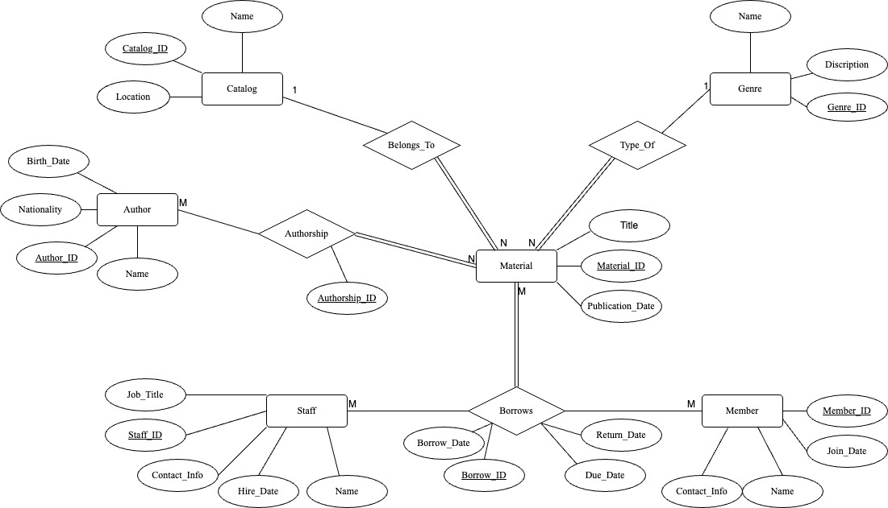

# Library-Database-Management-System-PostgreSQL-

## 📘 Overview

This project implements a **Library Database Management System** for a public library using **PostgreSQL**. It provides comprehensive management of library resources — including books, digital media, and journals — and tracks transactions by members and staff.

Designed as a final project for CS504 at George Mason University, it demonstrates advanced SQL-based schema modeling, entity relationships, triggers, and real-world queries.

---

## 🧩 Entities & Relationships

The database is based on a normalized ER model (3NF) featuring:

### Entities:
- `Catalog`: ID, Name, Location
- `Genre`: ID, Name, Description
- `Author`: ID, Name, Birth Date, Nationality
- `Material`: ID, Title, Publication Date, foreign keys to `Catalog` and `Genre`
- `Staff`: ID, Name, Job Title, Hire Date, Contact Info
- `Member`: ID, Name, Join Date, Contact Info

### Relationships:
- `Belongs_To`: Material → Catalog (1:N)
- `Type_Of`: Material → Genre (1:N)
- `Authorship`: Many-to-many between `Author` and `Material`
- `Borrows`: Ternary relationship between `Staff`, `Material`, and `Member`

---

## 🛠 Tools & Tech

- **PostgreSQL** for DDL/DML
- **pgAdmin** for DB administration
- **Draw.io** for ER Diagram
- **CSV** import for bulk data load
- SQL Triggers and Functions for automation

---

## 📦 Files

| Filename                | Purpose                          |
|-------------------------|----------------------------------|
| `Author.csv`            | Author data                     |
| `Authorship.csv`        | Join table for authors/materials|
| `Borrow.csv`            | Borrow transaction data         |
| `Catalog.csv`           | Catalog metadata                |
| `Genre.csv`             | Genre metadata                  |
| `Material.csv`          | Library items                   |
| `Member.csv`            | Library members                 |
| `CREATE_QUERIES.sql`    | Table definitions and inserts    |
| `CS_504_FINAL_PROJECT_REPORT.pdf` | Full project documentation |
| `ERD_Library_DB_Final_Project.jpg` | Entity-Relationship Diagram |

---

## 🔍 Sample Queries Executed

- ✅ Materials currently available (not borrowed)
- ⏰ Overdue materials with due dates
- 📈 Top 10 most borrowed items
- 🧑‍💼 Books authored by Lucas Piki
- ✍️ Books with 2+ authors
- 🏆 Most popular genres by borrow count
- 📅 Materials borrowed in a specific date range
- 🔄 Updating return date for a book
- ❌ Deleting member and associated records
- ➕ Inserting a new book + author

---

## 🚨 Advanced Features

### ✅ Trigger: Alert on Overdue

```sql
CREATE TRIGGER check_due_date
AFTER INSERT OR UPDATE ON "Lib".Borrow
FOR EACH ROW EXECUTE FUNCTION alert_librarians();
```

Automatically notifies when an overdue item is inserted/updated.

---

### ✅ Function: Membership Suspension Based on Overdues

```sql
CREATE FUNCTION manage_membership_status(member_id_arg INT)
RETURNS void AS $$
...
$$ LANGUAGE plpgsql;
```

Deactivates members with 3+ overdues in a month and reactivates if dues are cleared.

---

## 🚀 Setup Instructions

1. Create PostgreSQL database
2. Run `CREATE_QUERIES.sql` to generate schema
3. Import CSV data using pgAdmin or `COPY`
4. Execute sample queries
5. Implement triggers/functions for automation

---

## 🖼 ER Diagram



---

## 🙋‍♂️ Author

**Ritesh Somashekar** 

## ✅ Conclusion

This project demonstrates a robust and normalized library management database, showcasing best practices in SQL development, query optimization, and relational modeling using PostgreSQL.

